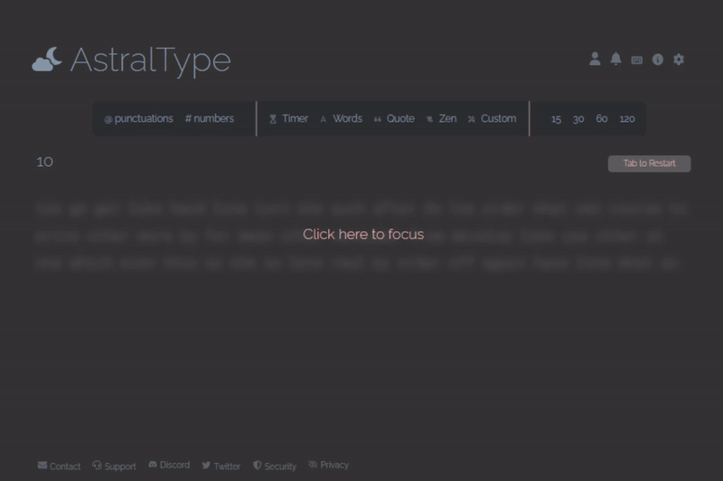

<link rel="stylesheet" type="text/css" href="style.html">
</img>

Versed in fullstack software development, digital image automation, SEO, UI/UX Design and neuroscience. I am deeply motivated by the use of technology for bettering even the slightest things of our elderlies' day-to-day lives.

<h2 align="center">Technologies:</h2>

  

---

<h2 align="center">Projects:</h2>

<table>
  <tr>
    <td width="50%">
     

       <h3 align="center">ProteusWorks | Your Shirt Visualized</h3>
        <h4 align="center">React & ThreeJS 3D Customization App</h4>
        

          <a href="https://www.proteusworks.com/">Create your own shirt now!</a>
        

        
        <h5 align="center">React.js, Three.js, Node Framer Motion, Tailwind CSS, REST API</h5>
        
Incorporating ThreeJS' 3D graphics library, a shirt customization platform is launched for creative purposes. It allows users to AI generate           their own descriptive pattern or upload their own logo onto the shirt.

      

    </td>
    <td width="50%">
      

        <h3 align="center">Caerus | Search your ideal job</h3>
        <h4 align="center">React Native Job Search App</h4>
        
        <h5 align="center">React Native, Node.js, Search Functionality, Pagination, REST API</h5>
        
Caerus is a mobile application that can search, filter, and geographically recommend jobs to the users. It has aesthically pleasing UI/UX design along with          best practices for React Native development.

      

    </td>
  </tr>
  <tr>
    <td width="50%">
      

        <h3 align="center">Orion | Ai Image Creator</h3>
        <h4 align="center">Ai Image Generator Social Media App</h4>
        
        <h5 align="center">React, Node.js, MongoDB, Express.js, Vite, Tailwind, CRUD</h5>
        
Create one-of-a-kind artifical intelligence images by inputting your custom descriptions.
          The image then can be downloaded for personal use or shared with others in the community.

      

    </td>
    <td width="50%">
      

        <h3 align="center">Janus | From London</h3>
        <h4 align="center">e-Commerce Luxury Watch Showcase</h4>
        
        <h5 align="center">React, JSX, HTML5, CSS3, CRUD</h5>
        
Utilizing React.js, a shopping platform was created for watches made in London. The website is lightweight, responsive to mobile devices, and                       minimalistic while maintaining class that is fitting for luxury watches.  

      

    </td>
  </tr>
  <tr>
    <td width="50%">
      

        <h3 align="center">AstralTypes</h3>
        <h4 align="center">JavaScript Speed Typing App</h4>
        
        <h5 align="center">JavaScript, HTML5, CSS3, CRUD</h5>
        
Find out your typing speed by filling out randomized quotes. The program will highlight the correct letters/words (in green) and incorrect letters/words           (in red). Your words-per-minute (WPM) will be calculated at the end.

      

    </td>
    <td width="50%">
      

        <h3 align="center">VancouverCabins</h3>
        <h4 align="center">Booking App for Cabins and Cottages</h4>
        
        <h5 align="center">React, MERN User Authentication, CRUD</h5>
        
A booking application created for a niche industry specializing in cabins and cottages. The website is SEO-optimized and focuses on quality of the               listing rather than the quantity. MERN authentication is added for user profiles and logins.

      

    </td>
  </tr>
</table>
